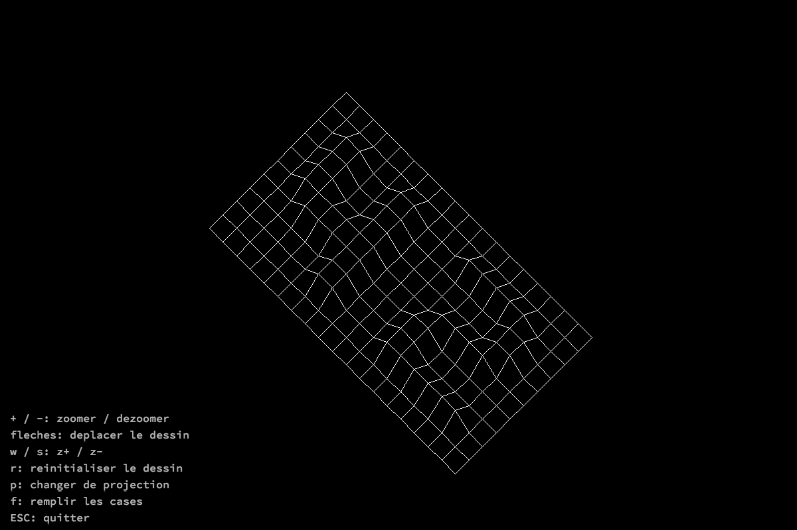

# FDF

## Description

Ce projet consiste à créer une représentation 3D simplifiée d'une carte en relief.



## Installation

``` bash
$> git clone https://github.com/bmoiroud/fdf.git && cd fdf && make
```

## Utilisation

```bash
$> ./fdf <map>
```

| Touche      | Action            |
|:-----------:|:------------------|
| + / -       | zoom + / -        |
| W / S       | z+ / z-           |
| P           | changer de projection |
| R           | réinitialiser la vue  |
| F           | remplissage           |
| Esc         | quitter           |
| Touches fléchées | déplacement       |
